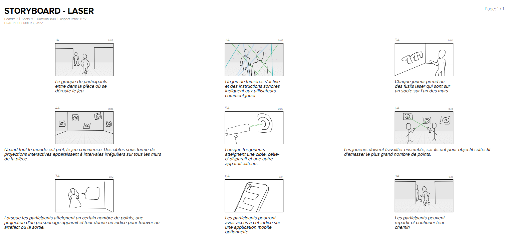

# Cours 14
## Plan de la présentation 3
Durée: 8 à 10 minutes

### Résumer votre projet en une phrase
Deux choix de parcours immersifs et interactifs sous forme de labyrinthe à thématique science-fiction.  

### Description du projet 
Deux labyrinthes adaptés selon l’âge des visiteurs, avec deux fins sont possible dans le parcours pour adultes (13 ans +). Indices, choix, et jeux interactifs en équipe pour gagner des indices supplémentaires pour guider les visiteurs dans l'histoire. Acteurs projeté en hologramme pour interagir avec le public.

### Technologies
Projections lumineuses, ambiance et effets sonores, planchers et murs interactifs, hologrammes, animations 2D et 3D, éléments mobiles, éléments interactifs

### Tâches
Concevoir les animations et les modélisations, installer les décors, les projecteurs, les structures et les hauts-parleurs, programmer les interactions
